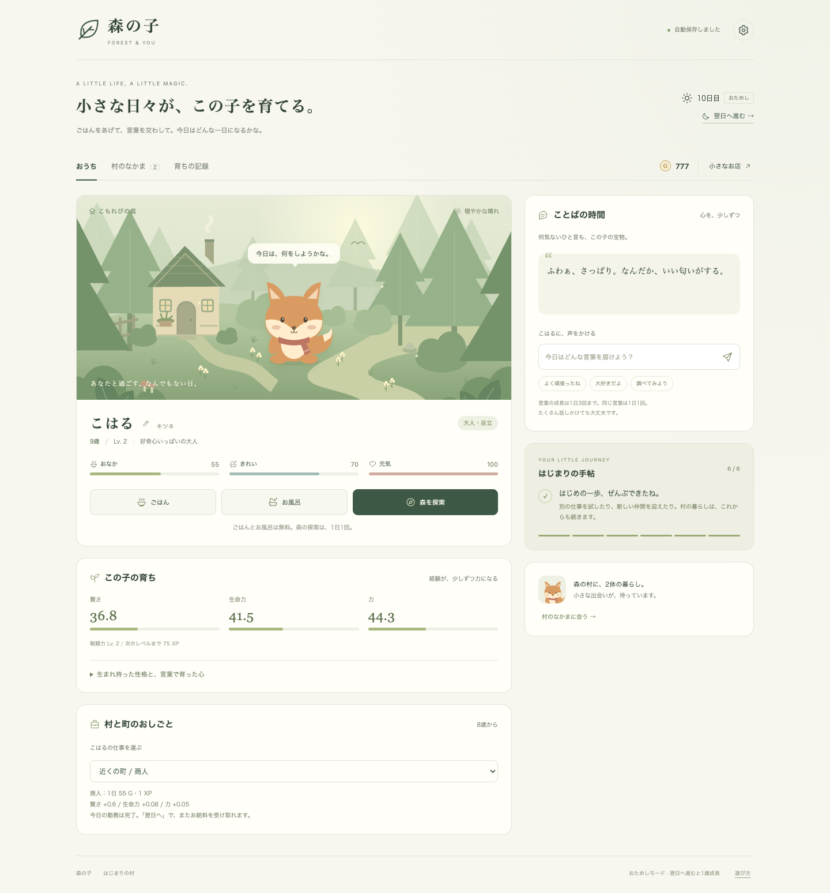
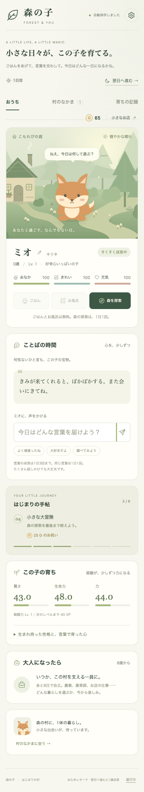

# 森の子 MVP v0.5 — 実装と検証

2026-09-08 作成。GitHub `main` の `46aac54` を起点に実装。
実装時の作業ブランチ：`feat/playable-mvp`。ユーザーの指定により、完成したMVPを `main` に反映する。

## できあがった体験

初回の出会い → 名前・種類の選択 → ごはん・お風呂・声かけ → 3場面の探索 → 日々の成長 → 8歳で自立 → 仕事と収入 → 贈りもの・村の仲間。
6つの目標をすべて達成した後も遊び続けられる。

通常の50日間の育成は維持し、最初の動作確認用に日送り式のおためしモードを追加した。セーブ領域は独立。
最初の実装は依存パッケージ・API・ビルドを必要としないHTML/CSS/JavaScript。画面用の絵もSVGとして同梱。

## 動作確認

- `npm test`：20 / 20 成功。
- `node --check app.js`、`node --check game.js`：成功。
- `git diff --check`：成功。
- Google Chrome + Playwright 1.62.1 によるブラウザ受け入れテスト。
  - お世話、自由文入力、探索3場面、探索途中の再読み込み。
  - 8日分を実際の画面操作で育成、成人、就職、転職、翌日の給与。
  - スカーフ購入、別種の保護加入、再読み込み。
  - おためし・通常モードを往復し、それぞれの保存を維持。
  - JSON書き出し、不正データ拒否、確認後の有効データ読み込み。
  - 別タブからの変更反映。
  - 390pxのスマートフォン操作、320 / 375 / 768 / 1024pxで横はみ出し確認。
  - 入力したHTML風の名前がHTMLとして解釈されないこと。
  - ブラウザ保存を拒否した環境でも、その場で遊べることと保存警告。
  - `file://` からサーバーなしで起動し、背景と操作が動くこと。
  - テスト対象の画面で未処理のJavaScript例外なし。

通常モードの実時間50日間は実際には待たず、同じシミュレーション関数への時間入力で検証した。iOS Safari・Android実機の確認は今回行っていない。

## 既存試作から修正した重要な点

- 長期間不在でも子ども時代のお世話不足を飛ばさず、固定1時間刻みで経過を反映する。
- 仕事の収入を再読み込み・転職で重複させない。未就業期間と死亡後の給与も発生させない。
- 探索開始・選択・帰宅を保存し、再読み込みで何度も報酬が取れないようにする。
- 全員が同じ時間軸で暮らす。あとから迎えた子の年齢は0歳から始まる。
- 死亡時の年齢を記録し、その後の時間送りで増やさない。
- 同じ声かけの連打で性格を大きく変えない。
- 読み込めないデータや保存失敗を黙って扱わず、元データと書き出しの手段を残す。

## 次の段階

結婚・親密度・出生・遺伝・20種の外見・世代交代は元の設計文書に残す。今回のMVPには含まない。
クラウド公開、アカウント・複数端末同期は今回実施していない。

## 画面

